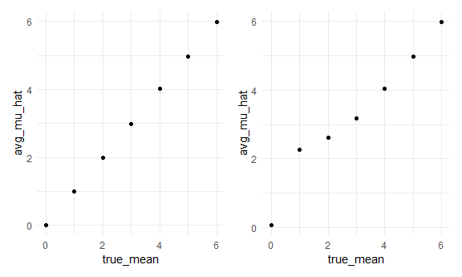

p8105\_hw5\_LF2649
================
Lin Feng
2020-11-18

Problem 1
=========

Read in data.
-------------

Test for a single city
----------------------

Try to iterate
--------------

Problem 2
=========

Import and tidy the data
------------------------

Create a tidy dataframe containing data from all participants, including the subject ID, arm, and observations over time:

\*Start with a dataframe containing all file names; the list.files function will help

\*Iterate over file names and read in data for each subject using purrr::map and saving the result as a new variable in the dataframe

\*Tidy the result; manipulate file names to include control arm and subject ID, make sure weekly observations are “tidy”, and do any other tidying that’s necessary

``` r
readin = function (x){
  read_csv(x)
}

participants_df = 
  tibble(
    path = list.files("data"),
  ) %>% 
  mutate(
    path = str_c("./data/", path),
    data = map(path, readin)) %>% 
  unnest() %>% 
  separate(path, sep="/", into = c("1","2","path") ) %>% 
  select(3:week_8)%>% 
  separate(path, sep = ".csv", into = c("id", "csv")) %>% 
  separate(id, sep = "_", into = c("arm", "id")) %>% 
  select(id, arm, week_1:week_8)
```

    ## Parsed with column specification:
    ## cols(
    ##   week_1 = col_double(),
    ##   week_2 = col_double(),
    ##   week_3 = col_double(),
    ##   week_4 = col_double(),
    ##   week_5 = col_double(),
    ##   week_6 = col_double(),
    ##   week_7 = col_double(),
    ##   week_8 = col_double()
    ## )
    ## Parsed with column specification:
    ## cols(
    ##   week_1 = col_double(),
    ##   week_2 = col_double(),
    ##   week_3 = col_double(),
    ##   week_4 = col_double(),
    ##   week_5 = col_double(),
    ##   week_6 = col_double(),
    ##   week_7 = col_double(),
    ##   week_8 = col_double()
    ## )
    ## Parsed with column specification:
    ## cols(
    ##   week_1 = col_double(),
    ##   week_2 = col_double(),
    ##   week_3 = col_double(),
    ##   week_4 = col_double(),
    ##   week_5 = col_double(),
    ##   week_6 = col_double(),
    ##   week_7 = col_double(),
    ##   week_8 = col_double()
    ## )
    ## Parsed with column specification:
    ## cols(
    ##   week_1 = col_double(),
    ##   week_2 = col_double(),
    ##   week_3 = col_double(),
    ##   week_4 = col_double(),
    ##   week_5 = col_double(),
    ##   week_6 = col_double(),
    ##   week_7 = col_double(),
    ##   week_8 = col_double()
    ## )
    ## Parsed with column specification:
    ## cols(
    ##   week_1 = col_double(),
    ##   week_2 = col_double(),
    ##   week_3 = col_double(),
    ##   week_4 = col_double(),
    ##   week_5 = col_double(),
    ##   week_6 = col_double(),
    ##   week_7 = col_double(),
    ##   week_8 = col_double()
    ## )
    ## Parsed with column specification:
    ## cols(
    ##   week_1 = col_double(),
    ##   week_2 = col_double(),
    ##   week_3 = col_double(),
    ##   week_4 = col_double(),
    ##   week_5 = col_double(),
    ##   week_6 = col_double(),
    ##   week_7 = col_double(),
    ##   week_8 = col_double()
    ## )
    ## Parsed with column specification:
    ## cols(
    ##   week_1 = col_double(),
    ##   week_2 = col_double(),
    ##   week_3 = col_double(),
    ##   week_4 = col_double(),
    ##   week_5 = col_double(),
    ##   week_6 = col_double(),
    ##   week_7 = col_double(),
    ##   week_8 = col_double()
    ## )
    ## Parsed with column specification:
    ## cols(
    ##   week_1 = col_double(),
    ##   week_2 = col_double(),
    ##   week_3 = col_double(),
    ##   week_4 = col_double(),
    ##   week_5 = col_double(),
    ##   week_6 = col_double(),
    ##   week_7 = col_double(),
    ##   week_8 = col_double()
    ## )
    ## Parsed with column specification:
    ## cols(
    ##   week_1 = col_double(),
    ##   week_2 = col_double(),
    ##   week_3 = col_double(),
    ##   week_4 = col_double(),
    ##   week_5 = col_double(),
    ##   week_6 = col_double(),
    ##   week_7 = col_double(),
    ##   week_8 = col_double()
    ## )
    ## Parsed with column specification:
    ## cols(
    ##   week_1 = col_double(),
    ##   week_2 = col_double(),
    ##   week_3 = col_double(),
    ##   week_4 = col_double(),
    ##   week_5 = col_double(),
    ##   week_6 = col_double(),
    ##   week_7 = col_double(),
    ##   week_8 = col_double()
    ## )
    ## Parsed with column specification:
    ## cols(
    ##   week_1 = col_double(),
    ##   week_2 = col_double(),
    ##   week_3 = col_double(),
    ##   week_4 = col_double(),
    ##   week_5 = col_double(),
    ##   week_6 = col_double(),
    ##   week_7 = col_double(),
    ##   week_8 = col_double()
    ## )
    ## Parsed with column specification:
    ## cols(
    ##   week_1 = col_double(),
    ##   week_2 = col_double(),
    ##   week_3 = col_double(),
    ##   week_4 = col_double(),
    ##   week_5 = col_double(),
    ##   week_6 = col_double(),
    ##   week_7 = col_double(),
    ##   week_8 = col_double()
    ## )
    ## Parsed with column specification:
    ## cols(
    ##   week_1 = col_double(),
    ##   week_2 = col_double(),
    ##   week_3 = col_double(),
    ##   week_4 = col_double(),
    ##   week_5 = col_double(),
    ##   week_6 = col_double(),
    ##   week_7 = col_double(),
    ##   week_8 = col_double()
    ## )
    ## Parsed with column specification:
    ## cols(
    ##   week_1 = col_double(),
    ##   week_2 = col_double(),
    ##   week_3 = col_double(),
    ##   week_4 = col_double(),
    ##   week_5 = col_double(),
    ##   week_6 = col_double(),
    ##   week_7 = col_double(),
    ##   week_8 = col_double()
    ## )
    ## Parsed with column specification:
    ## cols(
    ##   week_1 = col_double(),
    ##   week_2 = col_double(),
    ##   week_3 = col_double(),
    ##   week_4 = col_double(),
    ##   week_5 = col_double(),
    ##   week_6 = col_double(),
    ##   week_7 = col_double(),
    ##   week_8 = col_double()
    ## )
    ## Parsed with column specification:
    ## cols(
    ##   week_1 = col_double(),
    ##   week_2 = col_double(),
    ##   week_3 = col_double(),
    ##   week_4 = col_double(),
    ##   week_5 = col_double(),
    ##   week_6 = col_double(),
    ##   week_7 = col_double(),
    ##   week_8 = col_double()
    ## )
    ## Parsed with column specification:
    ## cols(
    ##   week_1 = col_double(),
    ##   week_2 = col_double(),
    ##   week_3 = col_double(),
    ##   week_4 = col_double(),
    ##   week_5 = col_double(),
    ##   week_6 = col_double(),
    ##   week_7 = col_double(),
    ##   week_8 = col_double()
    ## )
    ## Parsed with column specification:
    ## cols(
    ##   week_1 = col_double(),
    ##   week_2 = col_double(),
    ##   week_3 = col_double(),
    ##   week_4 = col_double(),
    ##   week_5 = col_double(),
    ##   week_6 = col_double(),
    ##   week_7 = col_double(),
    ##   week_8 = col_double()
    ## )
    ## Parsed with column specification:
    ## cols(
    ##   week_1 = col_double(),
    ##   week_2 = col_double(),
    ##   week_3 = col_double(),
    ##   week_4 = col_double(),
    ##   week_5 = col_double(),
    ##   week_6 = col_double(),
    ##   week_7 = col_double(),
    ##   week_8 = col_double()
    ## )
    ## Parsed with column specification:
    ## cols(
    ##   week_1 = col_double(),
    ##   week_2 = col_double(),
    ##   week_3 = col_double(),
    ##   week_4 = col_double(),
    ##   week_5 = col_double(),
    ##   week_6 = col_double(),
    ##   week_7 = col_double(),
    ##   week_8 = col_double()
    ## )

    ## Warning: `cols` is now required when using unnest().
    ## Please use `cols = c(data)`

``` r
ptcp_tidy =
  participants_df %>% 
  pivot_longer(
    "week_1":"week_8",
    names_to = "week",
    values_to = "values"
  )
```

Spaghetti plot
--------------

\*Make a spaghetti plot showing observations on each subject over time, and comment on differences between groups

``` r
spaghetti_plot = 
ptcp_tidy %>% 
  ggplot(aes(x = week, y = values, group = id)) + 
  geom_line() + 
  facet_grid(. ~ arm)+
  theme(axis.text.x = element_text(angle = 90, vjust = 0.5, hjust = 1))
```

Problem 3
=========

Generate 5000 datasets
----------------------

``` r
#Create the function
sim_ttest = function(n, mu = 0, sigma = 5) {
 
  sim_data = tibble(
    x = rnorm(n = 30, mean = mu, sd = sigma),
  )
 
    ttest=t.test(sim_data, mu=0, sd=5)
    ttest[['p.value']]
    ttest[['estimate']]
   
  sim_results = tibble(
     pvalue = ttest[['p.value']],
     mean = ttest[['estimate']]
  )
}


output = vector("list", 5000)
  for (i in 1:5000) {
    output[[i]] = sim_ttest(30)
}

sim_results = bind_rows(output)


#test with mean = 0
sim_results1 =
  rerun(5000, sim_ttest(30, 1, 5)) %>%
  bind_rows()
```

Simulating across multiple means.
---------------------------------

``` r
sim_results = 
  tibble(mn = c(0, 1, 2, 3, 4, 5, 6)) %>% 
  mutate(
    output_lists = map(.x = mn, ~rerun(5000, sim_ttest(30, mu = .x, 5))),
    estimate_dfs = map(output_lists, bind_rows)) %>% 
  select(-output_lists) %>% 
  unnest(estimate_dfs)
```

Making plot
-----------

-   Make a plot showing the proportion of times the null was rejected (the power of the test) on the y axis and the true value of μ on the x axis. Describe the association between effect size and power.

**Answer\_1:** As the mean increases we can find a trend that the power also increases.

``` r
plot_1 = 
sim_results %>% 
  mutate(
    reject = ifelse( pvalue < 0.05, 1, 0)) %>% 
  group_by(mn) %>% 
  mutate (
    proportion = mean(reject), 
        true_mean = str_c("mean=", mn)) %>% 
  slice(1) %>% 
  ggplot(aes(x = true_mean, y = proportion)) + 
  geom_point()
```

-   Make a plot showing the average estimate of μ^ on the y axis and the true value of μ on the x axis.

``` r
plot_2 = 
sim_results %>% 
  group_by(mn) %>% 
  mutate (
    avg_mu_hat = mean(mean), 
    true_mean = mn) %>% 
  slice(1) %>% 
  ggplot(aes(x = true_mean, y = avg_mu_hat)) + 
  geom_point() 
```

-   Make a second plot (or overlay on the first) the average estimate of μ^ only in samples for which the null was rejected on the y axis and the true value of μ on the x axis.
-   Is the sample average of μ^ across tests for which the null is rejected approximately equal to the true value of μ? Why or why not?

**Answer\_2:** The two plots are not the same. The reason could be that if we can reject the null when true\_mean is small, we estimated the mean\_hat will be greatly different from the true than when the true\_mean is larger.

``` r
plot_3 = 
sim_results %>% 
  filter(pvalue < 0.05) %>% 
  group_by(mn) %>% 
  mutate (
    avg_mu_hat = mean(mean), 
    true_mean =  mn) %>% 
  slice(1) %>% 
  ggplot(aes(x = true_mean, y = avg_mu_hat)) + 
  geom_point()
  
  
plot_2 + plot_3
```


